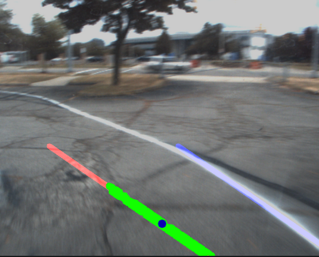

# Algorithm 2: Fictitious Line Follow Using Proportional Yaw Rate and Hough Lines

Clone this package into your catkin workspace. I call mine `actor_ws`.
```
git clone https://github.com/irisfield/fictitious_line_pkg.git ~/actor_ws/src
```

---




# Dependencies 
Follow the instructions [here](https://github.com/irisfield/shifted_line_pkg#dependencies).
